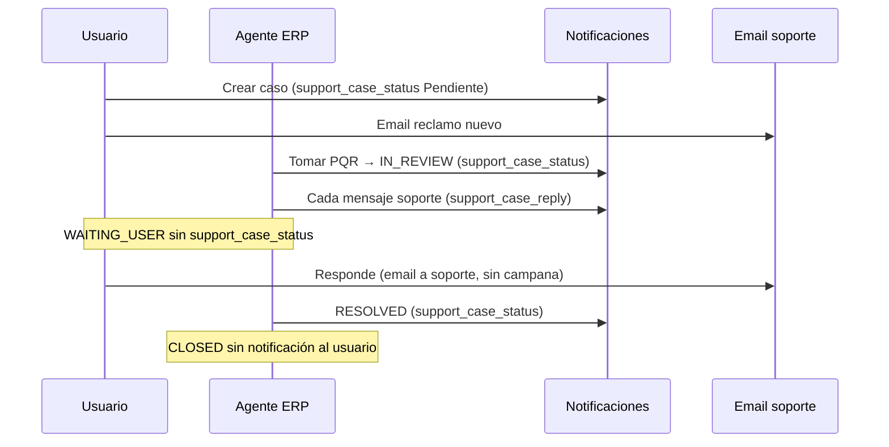

# Notificaciones al usuario — módulo postventa

Documento de referencia del comportamiento **actual** (in-app y email a soporte). No incluye email al usuario final.

---

## Estados que ve el cliente

| BD | Etiqueta en app |
|----|-----------------|
| `OPEN` | Pendiente |
| `IN_REVIEW`, `WAITING_USER` | En revisión |
| `RESOLVED` | Resuelto |
| `CLOSED` | Sin notificación; el cierre administrativo no se muestra en el timeline del usuario |

`WAITING_USER` sigue existiendo en BD para el turno de respuesta del cliente; no dispara campana `support_case_status`. El aviso de que puede escribir llega con `support_case_reply`.

---

## Canales

| Canal | Estado |
|-------|--------|
| Notificación in-app (campana) | Ver tabla abajo |
| Email al usuario | No implementado |
| Email a soporte (reclamo nuevo) | Sí, si hay `notificationEmail` en configuración ERP |
| Email a soporte (respuesta del cliente) | Sí, misma configuración |

Las notificaciones in-app se crean en `NotificationsService.createNotification` y, si el usuario tiene sesión Socket.IO activa, se emiten en tiempo real.

---

## Flujo de turnos (usuario ↔ soporte)

| Quién | Qué pasa |
|-------|----------|
| **Cliente crea PQR** | Estado `OPEN`. Campana **Solicitud registrada** (Pendiente). Email a soporte con el reclamo nuevo. |
| **Agente «Tomar PQR»** | Asignación + paso a `IN_REVIEW` en un solo paso. Campana **Tu solicitud está en revisión**. |
| **Soporte escribe** (`POST .../messages`) | `PUBLIC_MESSAGE`. Si estaba en `IN_REVIEW`, pasa a `WAITING_USER` **sin** evento de estado en historial. Campana `support_case_reply` (una por mensaje). |
| **Cliente** | Solo puede responder si el estado es `WAITING_USER`. |
| **Cliente responde** (`POST .../reply`) | `USER_MESSAGE` y vuelta a `IN_REVIEW` (evento `STATUS_CHANGED` de actor `SYSTEM`). **Email a soporte**; sin campana al cliente. |
| **Soporte** | Puede escribir en `IN_REVIEW` y `WAITING_USER`. Puede marcar **resuelto** desde ambos. |
| **Cerrar en ERP** (`CLOSED`) | Sin campana al cliente. |

---

## Tipos de notificación in-app

### `support_case_status`

**Cuándo se envía:**

1. **Creación** del caso (`createCase`, estado `OPEN`): título *Solicitud registrada*, mensaje *Tu reporte está pendiente de revisión.*
2. **Tomar PQR** si el caso estaba en `OPEN` → `IN_REVIEW`.
3. Transición admin a **`IN_REVIEW`** o **`RESOLVED`** vía `transitionCaseStatusAdmin` o `PATCH .../status` (solo si el nuevo estado está en la lista permitida).

**No se envía** para: `WAITING_USER`, `CLOSED`, asignación sin cambio de estado, mensaje de soporte que pasa silenciosamente a `WAITING_USER`, respuesta del cliente.

| Contexto / estado | Título | Mensaje |
|-------------------|--------|---------|
| Creación (`OPEN`) | Solicitud registrada | Tu reporte está pendiente de revisión. |
| `IN_REVIEW` | Tu solicitud está en revisión | El equipo de soporte está revisando tu reporte. |
| `RESOLVED` | Solicitud resuelta | Tu caso de soporte fue marcado como resuelto. |

**Payload `data`:**

```json
{
  "supportCaseId": "<cuid>",
  "supportCaseRef": "RCL-2026-0000123",
  "orderId": "<order cuid>"
}
```

**Navegación al tocar (app):** `/profile?case={supportCaseId}` — pestaña Mis Tankus, pedido asociado y modal «Mi solicitud».

---

### `support_case_reply`

**Cuándo se envía:** cada mensaje público del agente (`POST .../messages` → `addPublicMessageAdmin`).

| Campo | Valor |
|-------|--------|
| Título | `Soporte respondió ({supportCaseRef})` |
| Mensaje | Texto del mensaje, truncado a **120 caracteres** + `...` si es más largo |

**Payload `data`:** igual que `support_case_status`.

**Navegación al tocar:** igual que `support_case_status`.

---

## Historial en la app («Mi solicitud»)

- Orden **cronológico descendente** (más reciente arriba).
- Badge **«Último»** en el mensaje más reciente.
- El reporte inicial aparece en el historial como **Tu reporte inicial** (evento `CREATED`).
- Contacto, productos y evidencias van en **Detalle del reporte** (colapsable); la vista principal es el historial.
- No se muestran transiciones que involucren `CLOSED`.
- Al escribir soporte **no** aparece línea de estado por el paso automático a `WAITING_USER`.
- Tras responder el cliente puede aparecer **Actualización de estado** (p. ej. *En revisión → En revisión* por el evento `SYSTEM` al volver a `IN_REVIEW`).

Código: `tanku-front/lib/support-case-display.ts`.

---

## Eventos que **no** generan notificación al usuario

| Evento | Motivo |
|--------|--------|
| Asignación / «Tomar PQR» (sin paso desde `OPEN`) | Solo notifica si sube a `IN_REVIEW` desde `OPEN` |
| `WAITING_USER` (automático o manual) | Turno vía `support_case_reply` |
| `CLOSED` | Cierre interno sin aviso al cliente |
| Nota interna | `INTERNAL_NOTE` |
| Refresh Dropi | `DROPI_REFRESH` |
| Respuesta del cliente | Email a soporte; sin campana de confirmación |

---

## Notificaciones al equipo (soporte)

| Canal | Comportamiento |
|-------|----------------|
| **Email al crear caso** | Plantilla `support-case-new.template.js` si hay correo en Configuración → Postventa / Soporte. |
| **Email cuando el cliente responde** | Plantilla `support-case-user-reply.template.js`; asunto `Cliente respondió — RCL-…`. |
| **Retención evidencias** | Cron diario 04:00 (Bogotá); adjuntos &gt; 90 días (`SUPPORT_EVIDENCE_RETENTION_DAYS`). Tras purgar, ERP y app muestran aviso en el bloque de evidencias (`evidenceNotice`). |
| **Resolver sin mensaje** | Modal en ERP; API exige `acknowledgeNoReply: true` si no hay `PUBLIC_MESSAGE`. |

---

## Acciones ERP (referencia rápida)

| Estado | Botones de transición de estado |
|--------|--------------------------------|
| `OPEN` | Ninguno (usar **Tomar PQR** → asigna + `IN_REVIEW`) |
| `IN_REVIEW` | Marcar resuelto |
| `WAITING_USER` | Marcar resuelto |
| `RESOLVED` | Cerrar caso |

Etiqueta del stepper para `OPEN`: **Pendiente** (no «Abierto»).

Endpoints legacy en API sin botón en UI: `wait-for-user`, `start-review` desde `OPEN`.

---

## Flujo vs. notificaciones (diagrama)



---

## Redirección (implementada)

| Origen | URL |
|--------|-----|
| Notificación postventa | `/profile?case={supportCaseId}` |
| Tras checkout | `/profile?tab=MIS_TANKUS&orderId={orderId}` |

Código: `lib/support-case-navigation.ts`, `lib/notification-routing.ts`, `profile/page.tsx`, `orders-tab.tsx`, `order-support-section.tsx`.

---

## Workflow interno (RESOLVED vs CLOSED)

Ver [support-case-workflow-internal.md](./support-case-workflow-internal.md).

---

## Archivos de referencia

| Archivo | Rol |
|---------|-----|
| `tanku-backend/src/modules/support-cases/support-cases.service.ts` | Turnos, notificaciones, emails |
| `tanku-backend/src/email/templates/support-case-user-reply.template.js` | Email respuesta cliente |
| `tanku-front/lib/support-case-display.ts` | Historial y labels |
| `tanku-front/components/profile/order-support-section.tsx` | Modal «Mi solicitud» |
| `tanku-admin/lib/types/support-cases.ts` | Labels y transiciones ERP |

---

*Última revisión: Pendiente/En revisión/Resuelto público; tomar PQR → IN_REVIEW; campana al crear; email soporte al responder cliente; sin notif CLOSED/WAITING_USER por estado.*
