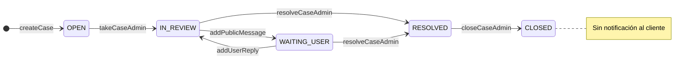

# PQR — workflow interno (RESOLVED, CLOSED y futuro)

Documento para equipo de producto y desarrollo. Describe estados **internos** en BD/ERP que no siempre coinciden con lo que ve el cliente.

---

## Estados en base de datos

| Estado | Uso interno | Vista cliente (etiqueta) |
|--------|-------------|---------------------------|
| `OPEN` | Recién creado, sin agente o antes de tomar | Pendiente |
| `IN_REVIEW` | Agente trabajando; cliente no puede escribir | En revisión |
| `WAITING_USER` | Turno del cliente (puede responder en app) | En revisión (sin campana de cambio de estado) |
| `RESOLVED` | Reclamo atendido desde soporte | Resuelto |
| `CLOSED` | Cierre administrativo tras subflujos | Sin notificación; oculto en timeline usuario |

---

## RESOLVED vs CLOSED

### `RESOLVED`

- El agente considera el reclamo **atendido** (respuesta dada, compensación acordada en conversación, etc.).
- El cliente recibe campana *Solicitud resuelta*.
- En ERP el caso puede seguir visible como resuelto hasta el cierre formal.

### `CLOSED`

- Cierre **administrativo** después de procesos que hoy **no están automatizados** en Tanku, por ejemplo:
  - Devolución de pedido registrada en otro sistema.
  - Reembolso ejecutado y confirmado.
  - Archivo definitivo del expediente.
- **No** se envía `support_case_status` al cliente.
- El timeline del usuario **no** muestra la transición a `CLOSED`.
- Flujo típico: `RESOLVED` → (trabajo manual / futuros subflujos) → `CLOSED` desde ERP.

No confundir «Resuelto» (cliente satisfecho con la gestión del caso) con «Cerrado» (expediente cerrado en backoffice).

---

## Diagrama de flujo objetivo

---

## Pseudoestados futuros (no implementados)

Para reclamos que requieran **devolución de producto**, **reembolso**, **reenvío**, etc., se recomienda **no** sobrecargar `SupportCaseStatus` con muchos valores.

Opciones de diseño (elegir una en su momento):

1. **`workflowTag` en el caso** — string o enum (`REFUND_PENDING`, `RETURN_SHIPPED`, …) editable desde ERP; visible solo en admin.
2. **Tabla hija `SupportCaseWorkflowStep`** — pasos con tipo, estado, fechas y referencias externas (ID devolución, guía, etc.).
3. **Integración con módulo de devoluciones** — el caso `RESOLVED` queda vinculado a una entidad `ReturnRequest`; `CLOSED` solo cuando esa entidad termina.

Reglas sugeridas:

- El cliente sigue viendo como máximo **Pendiente → En revisión → Resuelto**.
- Los pseudoestados son **solo ERP** o mensajes puntuales (`support_case_reply`), no nuevos tipos de campana `support_case_status` salvo decisión explícita de producto.
- `CLOSED` solo cuando todos los subflujos obligatorios estén completos.

---

## Referencias de código

| Acción | Método |
|--------|--------|
| Crear | `createCase` |
| Tomar + revisión | `takeCaseAdmin` |
| Mensaje soporte | `addPublicMessageAdmin` |
| Respuesta cliente | `addUserReply` |
| Resolver | `resolveCaseAdmin` → `transitionCaseStatusAdmin` |
| Cerrar | `closeCaseAdmin` → `transitionCaseStatusAdmin` (sin notif usuario) |

Notificaciones usuario: `USER_NOTIFY_STATUS_TRANSITIONS = ['IN_REVIEW', 'RESOLVED']` + creación explícita en `createCase`.

Documento relacionado: [support-case-user-notifications.md](./support-case-user-notifications.md).
