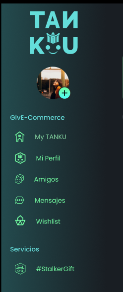

# Tanku — Especificación de diseño (Figma → implementación)

Documento vivo: se amplía por componente. Los valores vienen de Figma salvo que se indique “aproximado en navegador”.

---

## Sidebar (desktop)

**Alcance:** barra lateral fija en **desktop**; se mantiene en toda la plataforma autenticada / no autenticada según rutas que usen el layout principal.

### Referencias visuales

- Objetivo (referencia): 
- Estado / iteración:  *(actualizar si cambia)*

### Contenedor (frame de diseño)

| Propiedad | Valor Figma | Implementación (ajuste densidad) |
|-----------|-------------|----------------------------------|
| Ancho (`w`) | `260px` (frame) | **`208px`** (~80% del frame; sensación cercana a **zoom navegador 80%**) |
| Alto (`h`) | `1024px` | `100vh` / alto del layout (no fijo en px) |

### Fondo del sidebar

Gradiente lineal **horizontal** (no vertical) con **opacidad 20%** en la capa degradada, sobre fondo sólido `#191E23` (evita que el rail se vea “lavado” si solo se usan rgba sueltos).

**CSS de referencia:**

```css
background: linear-gradient(
    90deg,
    rgba(77, 254, 250, 0.2) 0%,
    rgba(25, 30, 35, 0.2) 100%
  ),
  #191E23;
```

*(No usar `180deg` / vertical salvo que Figma cambie.)*

### Logo Tanku

| Propiedad | Valor Figma | Implementación (densidad) |
|-----------|-------------|---------------------------|
| Tamaño | `120px` × `120px` | **`96px`** × **`96px`** (~80%) |
| Alineación | centrado horizontalmente | igual |

### Estado según sesión

| Estado | Comportamiento |
|--------|----------------|
| **No login** | No mostrar icono / avatar de usuario. |
| **Login** | Mostrar **icono de usuario** debajo del logo Tanku (orden vertical: logo → avatar). |

### Ítems de navegación (orden)

1. My TANKU  
2. Mi perfil  
3. Amigos  
4. Mensajes  
5. Wishlist  
6. StalkerGift  

### Hover (botones / filas de menú) — especificación Figma

Caja base Figma; en UI se aplica una **escala ~0,8** (anchos/radios/paddings proporcionales) para alinear con el rail estrecho.

**Caja del estado hover (Figma):**

| Propiedad | Valor |
|-----------|--------|
| `width` | `192px` |
| `height` | `32px` |
| `border-radius` | `20px` |

**Padding (Figma):** Top `5px`, Right `4px`, Bottom `12px`, Left `13px` — **Flex:** `gap` icono ↔ texto `26px`

**Implementación aproximada (~80%):** ancho fila ~`154px`, alto mín. ~`26px`, radio ~`16px` / `15px`, `gap` ~`20px`, texto ~`13px`.

**Relleno (fill) — gradiente “oscuro”:**

```css
background: linear-gradient(90deg, #486061 0%, #486061 63%, #190404 100%);
```

**Trazo (stroke) — gradiente “verde”, inside, `1px`:**

```css
background: linear-gradient(90deg, #73FFA2 0%, #666666 100%);
```

### Notas de UX

- **Scrollbar:** en el área de lista usar estilo fino acorde al tema (p. ej. clase `custom-scrollbar` del proyecto) para no competir con el diseño.
- **Circular menu / footer:** pueden escalarse ligeramente (`scale` ~0,82) para no dominar el ancho reducido.

---

## Historial de cambios

| Fecha | Sección | Cambio |
|-------|---------|--------|
| (inicial) | Sidebar | Primera versión |
| Revisión | Sidebar | Gradiente **horizontal**; ancho **208px**; densidad ~80%; doc alineado a implementación |
